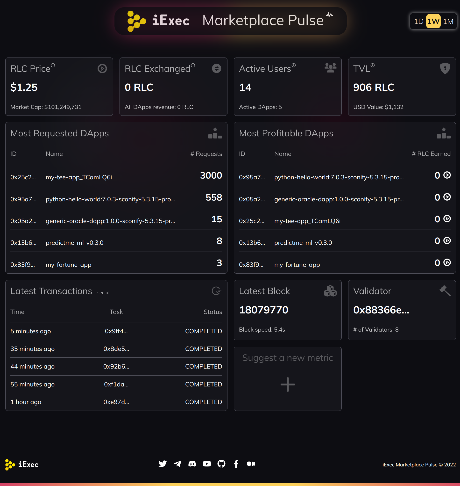

# [iExec Marketplace Pulse](https://marketplace-pulse.vercel.app/)

## Presentation

The iExec Marketplace Pulse is a dashboard showing key metrics of the iExec protocol.

## Look & feel



## Features & Key Metrics

- three time range (daily, weekly, monthly)
- responsive design targetting all devices
- RLC Price + marketcap (fetched from Coingecko)
- RLC Exchanged + DApps revenue
- Active Users + Active DApps
- TVL + USD Value
- Most Requested DApps
- Most Profitable DApps
- Latest Transactions
- Latest Block + Block speed
- Validator + # of validators
- "suggest new metrics" call to action

## Howto

### Install

```
npm i
```

### Try & Dev

```
npm start
```

### Build for production

```
npm build
```
